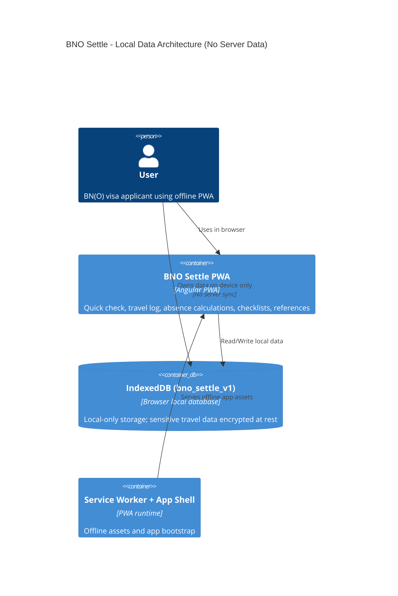
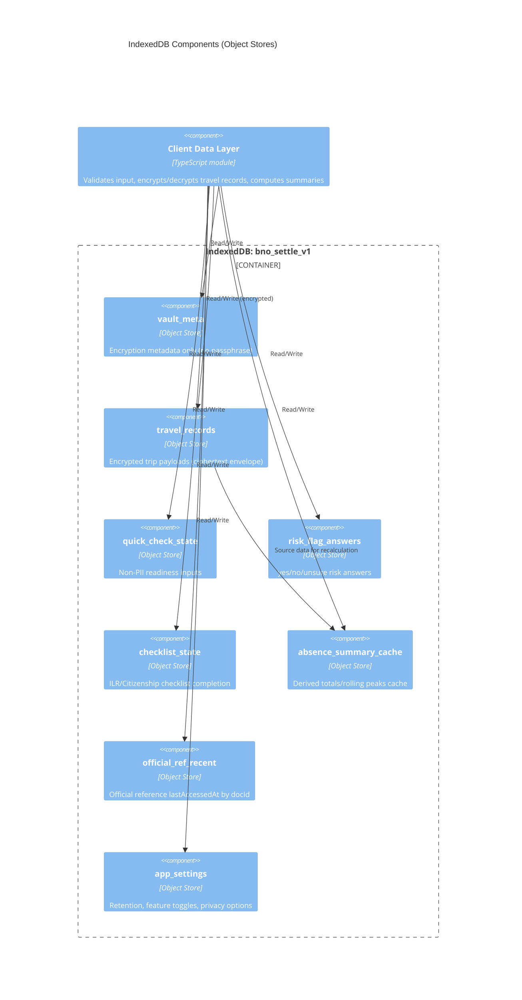

# BNO Settle IndexedDB Draft (C4 + Store Schema)

Source: `docs/functional-spec.md` (v2.1)

## 1) C4 Container Diagram

## 2) C4 Component Diagram (IndexedDB Object Stores)

## 3) IndexedDB Store Structure

Database:
- `name`: `bno_settle_v1`
- `version`: `1`

| Object Store | Key Path | Indexes | Purpose | Core Fields |
|---|---|---|---|---|
| `vault_meta` | `id` | `by_updatedAt (updatedAt)` | Encryption setup/lock metadata | `id`, `schemaVersion`, `keyVersion`, `kdf:{algo,saltB64,iterations,hash}`, `encryptedDekB64`, `dekIvB64`, `isLocked`, `createdAt`, `updatedAt` |
| `travel_records` | `id` | `by_updatedAt (updatedAt)`, `by_expiresAt (expiresAt)` | Travel log records as ciphertext only | `id`, `ciphertextB64`, `ivB64`, `aadB64`, `keyVersion`, `createdAt`, `updatedAt`, `expiresAt?` |
| `quick_check_state` | `profileId` | `by_updatedAt (updatedAt)` | Non-binding check inputs (non-PII) | `profileId` (default `default`), `monthsInUK`, `ilrGranted`, `monthsSinceILR`, `marriedToBritishCitizen`, `lifeInUkPassed`, `englishB1MetOrExempt`, `updatedAt` |
| `risk_flag_answers` | `flagCode` | `by_status (status)`, `by_updatedAt (updatedAt)` | Risk questionnaire responses | `flagCode`, `status` (`yes`/`no`/`unsure`), `updatedAt` |
| `checklist_state` | `id` | `by_track (track)`, `by_track_status ([track,status])` | Checklist completion state | `id` (`<track>:<itemCode>`), `track` (`ilr`/`citizenship`), `itemCode`, `status` (`todo`/`done`/`na`), `updatedAt` |
| `absence_summary_cache` | `id` | `by_computedAt (computedAt)` | Cached derived absence summary | `id` (default `latest`), `sourceHash`, `daysOutsideLast12Months`, `maxDaysOutsideInAnyRolling12Months`, `daysOutsideLast5YearsTotal`, `rolling12MonthPeaks[]`, `byCountryLast12Months?`, `computedAt` |
| `official_ref_recent` | `docId` | `by_lastAccessedAt (lastAccessedAt)` | Local recent access metadata for official docs | `docId`, `lastAccessedAt` |
| `app_settings` | `key` | none | Local feature/privacy settings | `key`, `value`, `updatedAt` |

## 4) Security and Compliance Notes

- `travel_records` stores only ciphertext envelope fields. Plain `departDate`, `returnDate`, and `destinationCountryCode` are inside encrypted payload.
- No PII fields (name/address/ID numbers/free-text notes) are present in any object store.
- No server sync store exists by design. Data scope is device-local only.
- Retention cleanup should use `travel_records.by_expiresAt` and recompute `absence_summary_cache` after deletions.

